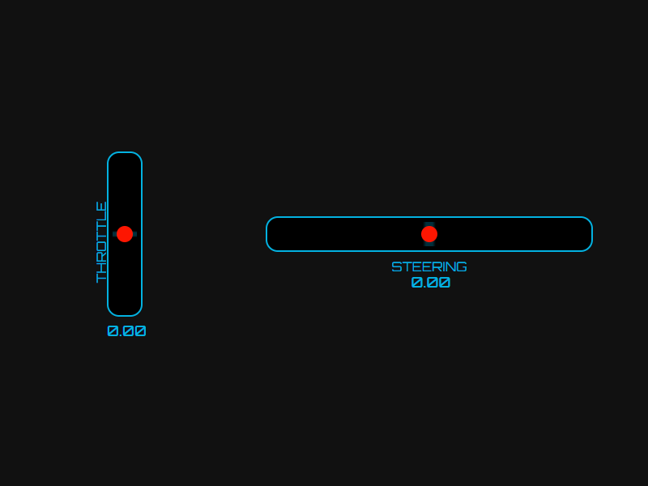

## RCコントローラービューア (RC Controller Viewer)

このプロジェクトは、RCカー用2chプロポの入力をリアルタイムで視覚化するウェブベースのツールです。スロットル（上下方向）とステアリング（左右方向）の操作量をゲージと数値で表示します。利用するにはプロポをUSBゲームパッドとして認識させることが必要です。

### 機能

- スロットル（Y軸）とステアリング（X軸）の操作量をリアルタイム表示
- バックグラウンドモードでの動作（ブラウザがフォーカスを失っても動作継続）
- デジタル表示で正確な値を確認可能
- シンプルで直感的なインターフェース

### 使い方

1. プロポをUSBでPCに接続します
2. ブラウザで `rc_controller_viewer.html` を開きます
3. コントローラーのスティックを操作すると、ゲージが動きます

### 注意点

ブラウザのセキュリティ制限により、以下の条件で動作が制限される場合があります：

- ゲームウィンドウがアクティブな場合、コントローラー入力がブラウザに届かないことがあります
- 別のアプリケーションがコントローラーを排他的に使用している場合は動作しません

### 配信で利用する方法

ゲーム実行中にコントローラー入力を取得するには、以下の方法があります。

1. **OBS Studio を使用する方法**:
   - OBSのブラウザソースとして `rc_controller_viewer.html` を追加します
   - ゲーム画面の上にオーバーレイとして表示できます

### ファイル構成

- `rc_controller_viewer.html` - メインのビューアアプリケーション

### 対応ブラウザ

- Google Chrome
- Mozilla Firefox
- Microsoft Edge

※ Gamepad API をサポートするブラウザが必要です。